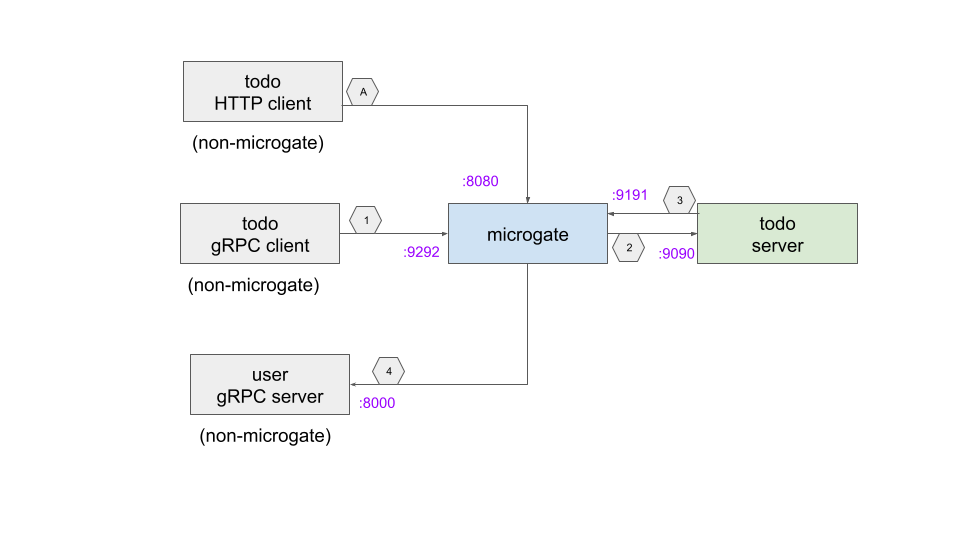

# microgate-demo

Example service using the micogate side-process.

## services

 
## compile api

	go install google.golang.org/protobuf/cmd/protoc-gen-go@v1.26
	go install google.golang.org/grpc/cmd/protoc-gen-go-grpc@v1.1 
	make pb

## run

### start microgate
### start user-server
### start todo-server
### run client test
